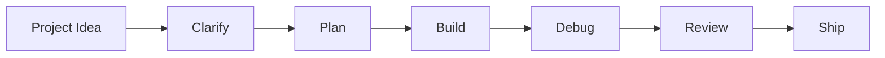

# AI Agent Dev Workflow

一个 **Local-first AI Agent 开发工作流工具**。它不是单纯的文档仓库，而是一个可以运行的前端应用，用来帮助开发者完成 AI Agent 辅助开发中的需求澄清、任务拆解、Prompt 生成、任务适配度评估和发布前检查。

## 功能特性

- **Prompt Builder**：根据项目目标、技术栈和约束条件生成结构化 Agent Prompt。
- **Task Planner**：自动生成 Agentic Development Workflow 任务计划。
- **Agent Fit Score**：评估一个任务是否适合交给 Agent 辅助，识别风险关键词。
- **Release Guard**：生成 GitHub 公开发布前的安全检查清单。
- **Markdown Export**：将 Prompt、任务计划和发布检查清单导出为 Markdown。
- **Local-first**：不调用外部 API，不上传用户输入，适合处理早期想法和内部需求。

## 快速开始

```bash
npm install
npm run dev
```

开发服务启动后打开终端显示的本地地址，例如：

```text
http://localhost:5173
```

## 构建

```bash
npm run build
npm run preview
```

## 使用方式

1. 输入项目名称、目标、技术栈和约束条件；
2. 选择 Prompt 模式，例如需求澄清、任务拆解、Debug 或发布检查；
3. 查看 Agent Fit Score，判断任务是否适合 Agent 辅助；
4. 复制或导出生成的 Agent Prompt；
5. 导出 Task Plan 和 Release Guard，作为项目文档或提交记录。

## 工作流



## 项目结构

```text
.
├── src/
│   ├── components/
│   │   ├── OutputPanel.jsx
│   │   ├── ProjectForm.jsx
│   │   ├── ScoreCard.jsx
│   │   └── WorkflowBoard.jsx
│   ├── data/
│   │   └── templates.js
│   ├── utils/
│   │   └── workflow.js
│   ├── App.jsx
│   ├── main.jsx
│   └── styles.css
├── docs/
│   ├── evaluation.md
│   ├── innovation.md
│   ├── prompt-patterns.md
│   ├── public-release-checklist.md
│   └── workflow.md
├── examples/
│   ├── agent-task-plan.md
│   ├── debug-case.md
│   ├── mini-project-case.md
│   └── requirement-template.md
├── index.html
├── package.json
├── vite.config.js
└── eslint.config.js
```

## 核心设计

### Agent Fit Score

在把任务交给 AI Agent 之前，先评估任务是否适合自动化或半自动化。项目会根据输入内容识别适合 Agent 的信号和需要谨慎的风险信号。

### Human-in-the-loop

项目默认 AI Agent 不应该替代开发者做最终决策。需求确认、代码审核、安全风险、发布检查都需要人工参与。

### Prompt as Artifact

Prompt 不是一次性聊天内容，而是可以复制、导出、复用和维护的开发资产。

### Release Guard

AI 辅助开发不仅要关注“能不能做出来”，也要关注“能不能安全公开”。Release Guard 会生成发布前检查清单，降低泄露敏感信息的风险。

## 适用场景

- 个人项目启动前的需求拆解；
- 小团队使用 AI Agent 规范开发流程；
- 生成 Debug 分析 Prompt；
- 生成 GitHub 发布检查清单；
- 沉淀 AI 辅助开发过程记录。

## 安全说明

本项目不包含后端服务，不会上传用户输入。所有生成逻辑都在浏览器本地完成。公开发布项目前仍建议检查：

- `.env`、Token、密钥和配置文件；
- 截图、日志和示例数据；
- Git 历史中的敏感内容；
- README 中是否存在夸大描述。

## License

MIT
