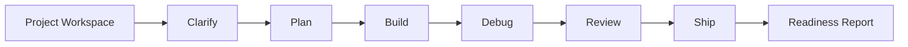

# AI Agent Dev Workflow

一个 **Local-first AI Agent Workflow Studio**。它是一个可以运行的 Vite + React 前端应用，用来帮助开发者管理 AI Agent 辅助开发项目：项目工作区、阶段看板、Prompt 生成、任务计划、风险矩阵、发布检查和 AI Readiness Report 都在浏览器本地完成。

## 功能特性

- **Project Workspace**：创建、切换、删除多个项目，数据保存到 localStorage。
- **Workflow Kanban**：跟踪 Clarify / Plan / Build / Debug / Review / Ship 六个阶段。
- **Prompt Builder**：根据项目目标、技术栈和约束条件生成结构化 Agent Prompt。
- **Task Planner**：自动生成 Agentic Development Workflow 任务计划。
- **Agent Fit Score**：评估一个任务是否适合交给 Agent 辅助，识别风险关键词。
- **Risk Matrix**：从需求清晰度、自动化适合度、数据敏感度、不可逆风险、人工审核必要性五个维度评分。
- **Release Guard**：生成 GitHub 公开发布前的安全检查清单。
- **AI Readiness Report**：一键导出项目概述、评分、风险矩阵、阶段进度和推荐下一步。
- **Local-first**：不调用外部 API，不上传用户输入，适合处理早期想法和内部需求。

## 快速开始

```bash
npm install
npm run dev
```

开发服务启动后打开终端显示的本地地址，例如：

```text
http://localhost:5173
```

## 常用命令

```bash
npm run lint
npm run test
npm run build
npm run preview
```

## 使用方式

1. 在 Project Workspace 中创建或选择项目；
2. 输入项目名称、目标、技术栈和约束条件；
3. 在 Workflow Kanban 中标记阶段状态并记录阶段备注；
4. 查看 Agent Fit Score 和 Risk Matrix；
5. 复制或导出 Agent Prompt、Task Plan、Release Guard；
6. 导出 AI Readiness Report，作为项目复盘或提交材料。

## 工作流



## 项目结构

```text
.
├── .github/
│   ├── ISSUE_TEMPLATE/
│   ├── workflows/
│   │   └── ci.yml
│   └── pull_request_template.md
├── src/
│   ├── components/
│   │   ├── OutputPanel.jsx
│   │   ├── ProjectForm.jsx
│   │   ├── RiskMatrix.jsx
│   │   ├── ScoreCard.jsx
│   │   ├── WorkflowBoard.jsx
│   │   ├── WorkflowKanban.jsx
│   │   └── WorkspaceSidebar.jsx
│   ├── data/
│   │   ├── defaults.js
│   │   └── templates.js
│   ├── hooks/
│   │   └── useProjects.js
│   ├── utils/
│   │   ├── workflow.js
│   │   └── workflow.test.js
│   ├── App.jsx
│   ├── main.jsx
│   └── styles.css
├── docs/
│   ├── evaluation.md
│   ├── innovation.md
│   ├── roadmap.md
│   ├── prompt-patterns.md
│   ├── public-release-checklist.md
│   └── workflow.md
├── CHANGELOG.md
├── index.html
├── package.json
├── vite.config.js
└── eslint.config.js
```

## 核心设计

### Project Workspace

项目不再是一次性输入。用户可以创建多个 Agent 开发项目，并在浏览器本地保存项目状态、阶段进度和备注。

### Agent Fit Score + Risk Matrix

在把任务交给 AI Agent 前，先判断任务是否适合 Agent 辅助。Risk Matrix 会从能力维度和风险维度给出更细粒度的判断。

### Human-in-the-loop

项目默认 AI Agent 不应该替代开发者做最终决策。需求确认、代码审核、安全风险、发布检查都需要人工参与。

### Prompt as Artifact

Prompt 不是一次性聊天内容，而是可以复制、导出、复用和维护的开发资产。

### AI Readiness Report

项目可以导出完整 Markdown 报告，用于复盘、协作、提交评审或长期维护。

## 工程质量

- Vite + React 标准前端工程；
- ESLint 代码检查；
- Vitest 单元测试；
- GitHub Actions CI；
- Issue / PR 模板；
- CHANGELOG 和 Roadmap。

## 适用场景

- 个人项目启动前的需求拆解；
- 小团队使用 AI Agent 规范开发流程；
- 生成 Debug 分析 Prompt；
- 管理 Agent 工作流阶段；
- 生成 GitHub 发布检查清单；
- 沉淀 AI 辅助开发过程记录。

## 安全说明

本项目不包含后端服务，不会上传用户输入。所有生成逻辑都在浏览器本地完成。公开发布项目前仍建议检查：

- `.env`、Token、密钥和配置文件；
- 截图、日志和示例数据；
- Git 历史中的敏感内容；
- README 中是否存在夸大描述。

## License

MIT
