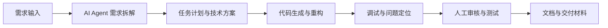

# AI Agent 辅助开发工作流

这是一个用于展示 AI Agent 如何参与软件开发全过程的示例项目。项目沉淀了一套从需求分析、任务拆解、代码生成、调试修复到文档交付的标准化流程，可作为 GitHub 展示项目、AI 工具申请证明材料或个人工作流样板。

## 项目目标

传统个人开发或小团队开发中，常见问题包括：

- 需求从想法到技术方案转换慢；
- 重复性代码、页面组件、接口说明和文档整理耗时；
- Bug 定位依赖人工阅读日志和逐步排查；
- 项目交付材料不完整，后续维护成本高。

本项目通过 AI Agent 辅助开发流程，尝试将上述环节标准化和自动化。

## 工作流概览



## 核心流程

### 1. 需求分析

使用 AI Agent 将自然语言需求转化为明确的功能目标、用户场景、边界条件和验收标准。

### 2. 任务拆解

将项目拆成可执行的任务清单，包括前端、后端、数据处理、测试和文档等模块。

### 3. 代码生成与修改

使用 Claude Code、Cursor、Codex 等工具读取项目结构，辅助生成代码、修改已有模块、重构重复逻辑。

### 4. 调试与修复

将报错日志、运行结果或异常截图交给 Agent 分析，由 Agent 提供可能原因、修复方案和验证步骤。

### 5. 交付整理

由 AI 自动整理 README、接口说明、部署步骤、测试清单和使用说明，降低交付成本。

## 使用工具

- Claude Code
- Cursor
- Codex
- Cline
- GPT 系列模型
- Claude 系列模型
- DeepSeek 系列模型

## 效果评估

基于个人实际使用经验，AI Agent 辅助开发流程带来的主要提升包括：

| 指标 | 传统方式 | Agent 辅助后 | 预估提升 |
| --- | --- | --- | --- |
| 需求拆解 | 人工整理需求和方案 | Agent 生成初版方案，人工修订 | 约 60% |
| 初版代码 | 手写样板代码和基础页面 | AI 生成初版代码 | 约 40% - 60% |
| Bug 定位 | 人工阅读日志逐步排查 | Agent 分析错误并给出修复方向 | 约 30% - 50% |
| 文档整理 | 手动编写 README 和说明 | AI 自动生成初稿 | 约 70% |

> 注：以上数据来自个人项目中的经验估算，用于说明效率改善方向，并非严格实验统计。

## 项目结构

```text
.
├── README.md
├── docs/
│   ├── workflow.md
│   ├── proof-materials.md
│   └── evaluation.md
├── examples/
│   ├── requirement-template.md
│   ├── agent-task-plan.md
│   └── debug-case.md
└── demo/
    └── index.html
```

## 适用场景

- 个人开发者展示 AI 编程能力；
- AI 工具资助、试用或评选申请；
- 团队内部沉淀 Agent 开发流程；
- 软件项目从需求到交付的标准化模板。

## 申请材料描述参考

> 我基于 Claude Code、Cursor、Codex 等 AI 开发工具，构建了一套 AI Agent 辅助开发工作流，用于提升个人项目和业务工具开发效率。该流程覆盖需求分析、任务拆解、代码生成、调试修复、测试验证和文档交付。实际使用中，常规项目初版搭建速度明显提升，重复性文档和样板代码基本可以由 AI 完成，整体开发效率提升约 40%—60%。

## License

MIT
