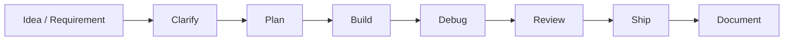

# Agentic Dev Workflow

一套面向个人开发者和小团队的 AI Agent 辅助开发工作流模板。它把软件开发中常见的需求澄清、任务拆解、代码实现、调试修复、测试验证和文档交付整理成一套可复用流程，帮助开发者更稳定地使用 AI 工具完成真实项目。

> 这个仓库不是单纯的“AI 生成代码展示”，而是一个可落地的开发流程样板：人负责判断、取舍和验收，Agent 负责加速分析、生成、排查和整理。

## 为什么做这个项目

在个人项目或小团队协作中，开发者经常需要同时承担产品、研发、测试和文档角色。常见问题包括：

- 需求从一句想法变成可执行方案的过程不稳定；
- 样板代码、页面结构、接口说明和测试清单存在大量重复劳动；
- Debug 经常依赖人工逐行排查，缺少系统化路径；
- 项目交付文档容易滞后，影响后续维护；
- 使用 AI 工具时缺少统一流程，效果依赖临时提问质量。

本项目希望把这些经验沉淀成一套简单、透明、可复用的 Agentic Development Workflow。

## 工作流概览



## 核心原则

1. **人做最终判断**：AI 可以生成方案和代码，但架构取舍、业务判断、安全风险必须由开发者确认。
2. **先拆解再执行**：复杂需求先拆成任务、验收标准和风险点，避免直接写代码导致返工。
3. **保留可追溯记录**：关键决策、Debug 过程和交付说明要沉淀为文档。
4. **小步验证**：每次修改尽量可运行、可检查、可回滚。
5. **不上传敏感信息**：公开仓库中不包含 Token、密钥、账号密码、私有日志或客户数据。

## 流程说明

### 1. Clarify：需求澄清

把模糊想法转成明确的目标、用户场景、功能边界和验收标准。

产物示例：

- 目标用户；
- 核心功能；
- 非目标范围；
- 验收标准；
- 风险点。

### 2. Plan：任务拆解

将需求拆成可执行任务，明确优先级和依赖关系。

产物示例：

- 任务清单；
- 技术方案；
- 文件结构建议；
- 测试路径；
- 发布检查项。

### 3. Build：代码实现

使用 Claude Code、Cursor、Codex、Cline 等工具辅助生成代码、修改现有模块或重构重复逻辑。

适合交给 Agent 的任务：

- 生成页面和组件初稿；
- 编写工具函数；
- 整理数据处理脚本；
- 添加注释和类型；
- 重构重复逻辑；
- 生成 README 初稿。

### 4. Debug：问题定位

将错误信息、日志、复现步骤和相关代码交给 Agent 分析，形成排查路径。

产物示例：

- 可能原因列表；
- 优先排查顺序；
- 修复建议；
- 验证步骤。

### 5. Review：人工审核

所有 AI 产物都必须经过人工检查。

检查重点：

- 是否符合真实需求；
- 是否引入无关依赖；
- 是否存在安全隐患；
- 是否破坏已有功能；
- 是否可维护。

### 6. Ship：交付发布

整理最终产物，包括运行说明、部署步骤、测试记录和版本说明。

## 仓库结构

```text
.
├── README.md
├── demo/
│   └── index.html
├── docs/
│   ├── evaluation.md
│   ├── proof-materials.md
│   ├── prompt-patterns.md
│   ├── public-release-checklist.md
│   └── workflow.md
├── examples/
│   ├── agent-task-plan.md
│   ├── debug-case.md
│   ├── mini-project-case.md
│   └── requirement-template.md
├── LICENSE
└── .gitignore
```

## 示例使用方式

你可以把本仓库作为模板，用于任意小型项目：

1. 在 `examples/requirement-template.md` 中写下项目需求；
2. 使用 `examples/agent-task-plan.md` 生成任务计划；
3. 按照 `docs/workflow.md` 执行开发流程；
4. 遇到问题时参考 `examples/debug-case.md` 组织 Debug 信息；
5. 发布前使用 `docs/public-release-checklist.md` 做公开仓库检查。

## 常用工具

- Claude Code
- Cursor
- Codex
- Cline
- GitHub Copilot
- GPT / Claude / DeepSeek / Gemini 系列模型

## 效果评估

基于个人项目经验，Agent 辅助流程主要改善以下环节：

| 环节 | 传统方式 | Agent 辅助方式 | 经验性改善 |
| --- | --- | --- | --- |
| 需求拆解 | 手动整理需求和方案 | Agent 生成初稿，人工修订 | 明显减少前期整理时间 |
| 初版代码 | 手写样板代码和基础页面 | AI 生成初版，人工校验 | 降低重复编码成本 |
| Debug | 人工阅读日志逐步排查 | Agent 总结原因并给出路径 | 缩短无方向排查时间 |
| 文档整理 | 发布前集中补文档 | 开发中同步沉淀 | 提高交付完整度 |

详细评估见：[`docs/evaluation.md`](docs/evaluation.md)。

## 安全说明

本仓库刻意不包含任何真实账号、Token、密钥、客户数据或私有业务代码。公开发布前建议再次检查：

- `.env`、配置文件和日志；
- 截图中的个人信息；
- Git 历史中的敏感内容；
- 第三方依赖和许可证。

详见：[`docs/public-release-checklist.md`](docs/public-release-checklist.md)。

## License

MIT
